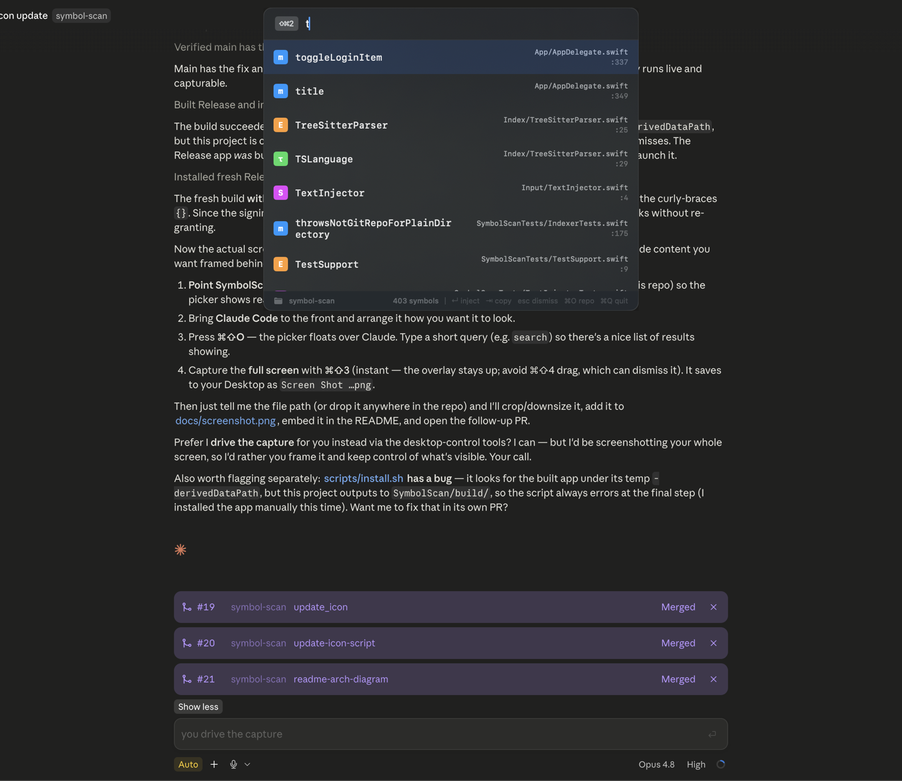
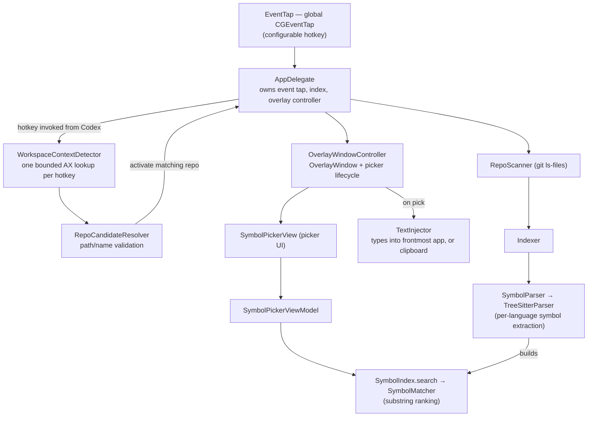

# SymbolScan

A macOS overlay that helps you drop code symbols - think functions, files and directories - into prompts for AI coding
tools like Claude Code and Codex — without leaving your keyboard or hunting for the exact
name and path.

[](https://github.com/one-melange/symbol-scan/actions/workflows/tests.yml)
[](LICENSE)




## Why

I wanted to reference actual functions in my agent's prompts and I didn't want to be limited by the functionality of `@` from Claude and ChatGPT.

## What it is

When you're prompting an AI coding assistant, you constantly need to reference things - 
`SymbolMatcher`, `Index/RepoScanner.swift:42`, a directory path - to keep token use low. 

Typing them from memory is impossible! Repositories often end up with hundreds of symbols, so you need a way to quickly find the one you need.

SymbolScan runs invisibly in the menu bar. A global hotkey pops a picker over
whatever app you're in, you type to filter symbols indexed from your current git repo, and
the one you choose is injected straight into the focused app (or copied to the clipboard).
Code symbols are injected as a file-anchored reference like `@Index/SymbolIndex.swift:105 search`,
so the assistant knows exactly where the symbol lives.

## Triggers

Press the trigger anywhere and the picker appears over the focused app; choose a symbol and
it's injected there (or copied to the clipboard):

| Trigger | Intended for | Behavior |
| --- | --- | --- |
| `⌘⇧O` | Just like IDE-style "open symbol" | Pick a symbol and inject it into the focused editor |

The trigger is configurable via the menu bar item for the app.

## Features

- **Real parsing, not regex** — symbols are extracted with actual [Tree-sitter](https://tree-sitter.github.io/tree-sitter/)
  grammars, so method-vs-function is decided by the parse tree rather than indentation guesses.
- **Multi-language** — Swift, Python, TypeScript (`.ts`), TSX (`.tsx`), JavaScript (`.js`/`.jsx`),
  Rust, and Go.
- **Files and directories too** — every tracked file and directory is searchable/injectable
  as a path, alongside in-file symbols.
- **Automatic repo context** — when the picker hotkey is invoked from Codex, one bounded macOS
  Accessibility probe reads its project-folder control. The picker opens immediately and refreshes
  if the probe resolves a different repo. Unsupported apps keep the current repo. Detection and
  desktop notifications for successful automatic switches have independent menu-bar toggles.
- **Predictable substring matching** — filtering is strict "contains", ranked so exact and
  prefix hits surface first (no surprising scattered-subsequence matches).
- **Fast and out of the way** — a menu-bar-only (`.accessory`) app with no dock icon; the
  index is built off the main thread and cached per repo, so repo switches and relaunches
  skip the rescan.
- **Inject or copy** — types into the frontmost app when possible, falls back to the clipboard.
- **No MCP** — unlike CodeGraph and graphify, SymbolScan is batteries included and works out of the box.

## Requirements

- **macOS 14** (Sonoma) or later
- **Xcode 26.5** or later (to build)
- An Apple ID for code signing — a free Personal Team is enough; no paid Developer Program
  required. Stable signing is what lets macOS keep the Accessibility grant across rebuilds
  (see [DEVELOPMENT.md](DEVELOPMENT.md)).

## Getting started

```bash
git clone https://github.com/one-melange/symbol-scan.git
cd symbol-scan
```

1. Open `SymbolScan/SymbolScan.xcodeproj` in Xcode.
2. Set your signing team without touching the tracked project:
   ```bash
   cp SymbolScan/Local.xcconfig.example SymbolScan/Local.xcconfig
   # edit Local.xcconfig: DEVELOPMENT_TEAM = <YOUR_TEAM_ID>
   ```
   `Local.xcconfig` is git-ignored, so your team ID never lands in a commit. Full details,
   including how to find your Team ID, are in [DEVELOPMENT.md](DEVELOPMENT.md).
3. Build and run (`⌘R`).
4. Grant **Accessibility** when prompted (System Settings → Privacy & Security → Accessibility
   → enable **SymbolScan**). This is required for the global hotkey, text injection, and
   automatic repo detection.
5. From the menu-bar item, choose a git repo to index (**Choose Repo…**) as your fallback.
   Invoke the SymbolScan hotkey after moving to a project in Codex to detect it; other apps
   continue using the current repo.

## Install it (run outside Xcode)

SymbolScan is a menu-bar app, so day-to-day you want it running without Xcode open. Once your
signing is set up (step 2 above), install a Release build into `/Applications`:

```bash
./scripts/install.sh
```

This builds Release, copies `SymbolScan.app` to `/Applications`, and launches it — after which
you can start it any time from Spotlight or Finder. To have it start automatically, open the
menu-bar menu and tick **Open at Login** (registered via `SMAppService`; meaningful only for the
installed `/Applications` copy, not a build launched from Xcode).

## How it works



Each hotkey invocation from Codex starts one project-selector probe. It stops shortly after finding
that control and is time/node/depth bounded; snapshots are not persisted, and Release builds do not
log AX text. There are no background AX scans or app-activation observers.
App-specific providers are registered separately from the traversal and shared resolver,
leaving a narrow extension point for Terminal, iTerm, Ghostty, or other apps that can expose a
focused tab's working directory in the future.

The pure, IO-free logic (matching/ranking, per-language queries, workspace candidate
resolution) is deliberately kept off the main actor so it can be unit-tested in isolation.

## Testing

```bash
cd SymbolScan
xcodebuild test -scheme SymbolScan -destination 'platform=macOS'
```

Tests live in the **SymbolScanTests** target (Swift Testing) and cover symbol
matching/ranking, the per-language Tree-sitter queries, `RepoScanner` path helpers, language
detection, and the picker flow — no UI, git, or system permissions required. CI runs the
same suite on every push and PR, with a code-coverage gate. See [DEVELOPMENT.md](DEVELOPMENT.md#testing)
for details.

## Contributing

Issues and PRs are welcome. The standing backlog lives in [TASKS.md](TASKS.md), and
architecture notes for contributors are in [CLAUDE.md](CLAUDE.md) and
[DEVELOPMENT.md](DEVELOPMENT.md). Please run the test suite before opening a PR.

## License

[MIT](LICENSE) © 2026 Pritam M.
